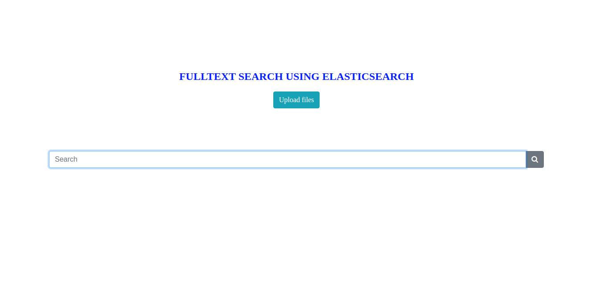
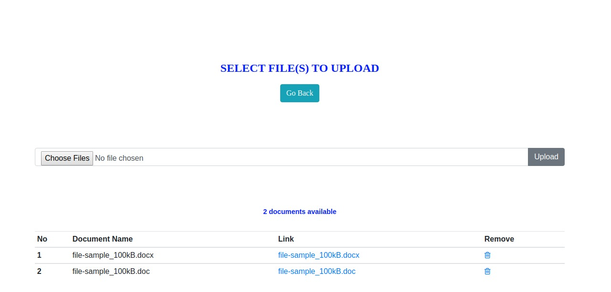
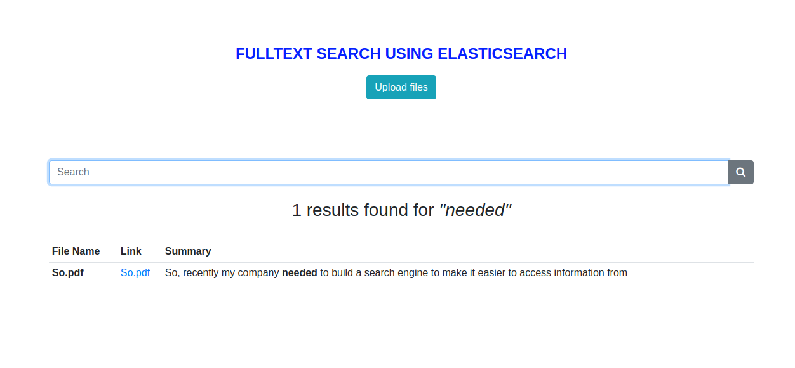

# Fulltext Search Using elasticsearch
The following has been used in developing this project
* Elasticsearch v7.6.1
* fscrawler v7-2.7-SNAPSHOT
* python v3.8.2
* Flask v1.1.2

To run this project,ensure the environment is setup with the requirements listed above (version variation is cautiously advised).

>Follow the following steps to set up the environment:
>* Install Elasticsearch --refer [Elasticsearch](https://www.elastic.co/guide/en/elasticsearch/reference/current/install-elasticsearch.html)
>* Set up fscrawler - Use attached fscrawler-es7-2.7-SNAPSHOT file, navigate to fscrawler location
   
    cd [project location path]/fscrawler/fscrawler-es7-2.7-SNAPSHOT
 
>Create index 'testing_index'

     bin\fscrawler — config_dir ./DS testing_index — loop 1
 
 Now edit fscrawler install location > DS > testing_index >_settings.yaml or yml file

    Looks like
            name: "testing_index"
            fs:
              url: "{project_base_directory}/static/documents" // provide project_base_directory with
                your project home directory path
                update_rate: "15m" // change this value to 10s or any value that will allow quick update
                preferably less than a minute (shound end with s to mean seconds)
              excludes:
              - "*/~*"
              json_support: false
              filename_as_id: false
              add_filesize: true
              remove_deleted: true
              add_as_inner_object: false
              store_source: false
              index_content: true
              attributes_support: false
              raw_metadata: false
              xml_support: false
              index_folders: true
              lang_detect: false
              continue_on_error: false
              ocr:
                language: "eng"
                enabled: true
                pdf_strategy: "ocr_and_text"
              follow_symlinks: false
            elasticsearch:
              nodes:
              - url: "http://127.0.0.1:9200" // change this to point to elasticsearch server url
              bulk_size: 100
              flush_interval: "5s"
              byte_size: "10mb"

> After editing the file, re-run the command

    bin\fscrawler — config_dir ./DS testing_index — loop 1  // Before you run please ensure elasticsearch server is running in server url you provided above

> * Install python dependencies, if you don't have python in your environment please install first. Refer [Python](https://www.python.org/downloads/)
'''This project requires the following dependecies:
    elasticsearch,
    flask
'''

    python -m pip install flask
    python -m pip install Elasticsearch

## Running the project
Navigate to the root directory of the project and run the following command

    python -m flask run
    
> This is web app ,to interact with it ,open you browser and navigate to

    http://localhost:5000
 
> Home Page

> Start with uploading your documents by clicking on [Upload files],accepts pdf,word documents and text files. This take you to this view

> You can now search using your key words,results looks like the following

# Thanks
This project was developed in linux environment,incase of change in environment i.e windows or mac os,ensure you make necessary changes on directory paths

Keep safe
